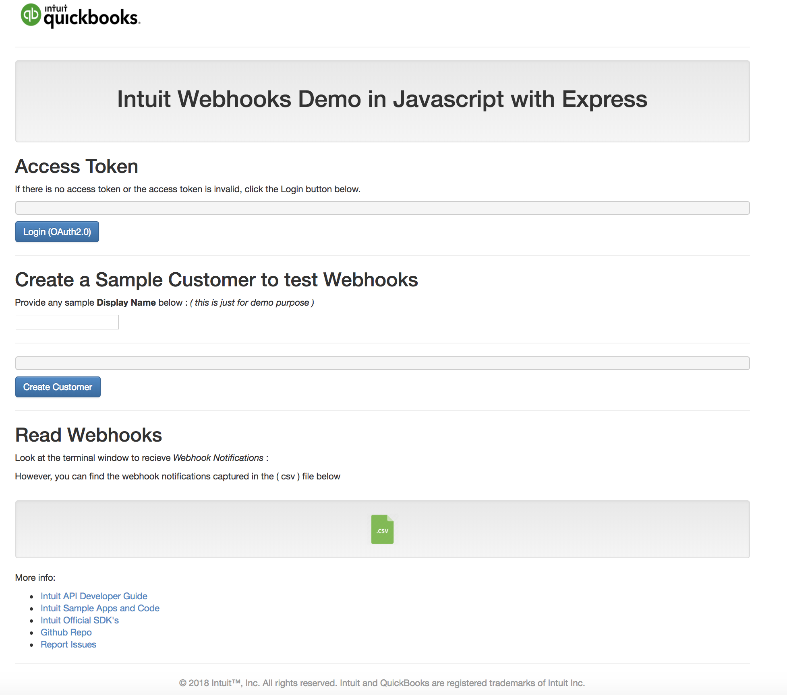

[][ss1][][ss2][][ss3]


Intuit-WebhookNotifications-Demo in Javascript with Express
==========================================================
[](https://13b662a8.ngrok.io)


## Overview

This is a quick OAuth2.0 incorporated demo that runs using JavaScript, Node.js and Express with the   
[node-quickbooks](https://github.com/mcohen01/node-quickbooks) SDK

This sample app is meant to showcase an example of how to integrate your app with the Intuit Developer Platform. It showcases the following:

* Authorize into the app via OAuth2.0 ( Ref to [OAuth2.0 for server side web-apps](https://developer.intuit.com/docs/00_quickbooks_online/2_build/10_authentication_and_authorization/10_oauth_2.0) for more information )
* Create a sample customer 
* Receive webhook notifications
* Write the notifications to a CSV file 


## Installation

### Via Github Repo (Recommended)

```bash
$ git clone https://github.com/IntuitDeveloper/SampleApp-WebhookNotifications-nodejs
$ cd SampleApp-WebhookNotifications-nodejs
$ npm install
```

## Configuration

Copy the contents from `sample-config.json` to `config.json`:

```bash
$ cp sample-config.json config.json

```

Edit the `config.json` file to add your:  

* **clientId:** You can find your `clientId` from the `Keys` tab under your `App` listed on the developer portal
* **clientSecret:** You can find your `clientSecret` from the `Keys` tab under your `App` 
* **redirectUri:** The `redirectUri` for your app ( **OAuth2.0** )
* **webhookUri:** You can find your `webhookUri` from the `Webhooks` tab under your `App`  
* **webhooksVerifier:** copy the `show token` from the `Webhooks` tab under your `App` 


In the [Developer Portal](http://developer.intuit.com/), ensure the redirect URI in your `config.json` file has been entered in your app configuration. By default, the URL is set to the following for this demo:


Some properties of note:  


| Property | Description |   
|----------|-------------|   
| `redirectUri` | This is the OAuth 2.0 redirect URL, this will end in `/call` and be something like `http://localhost:3000/callback` or `https://755c8b38.ngrok.io/callback`. This needs to be configured in your app in the Developer Portal(https://developer.intuit.com) |  
| `webhookUri` | This is the webhook URL which ends in `/webhook` and can be something like `https://yourdomain.com/webhook` or `https://755c8b38.ngrok.io/hook`. |  


### TLS / SSL


Webhooks requires your enpoint to be exposed over the internet. The easiest way to do that while you are still developing your code locally is to use [ngrok](https://ngrok.com/).  

Here are the steps to configure ngrok  
1. Download and install ngrok  
2. Expose your localhost by running "ngrok http 3000" on the command line.  
3. You will then get a forwarding url that looks something like this: Forwarding https://755c8b38.ngrok.io -> localhost:3000

This will expose localhost:3000 to the Internet. Your endpoint url will now be https://755c8b38.ngrok.io/webhooks Copy this url and use it for setting up webhooks on [Intuit Developer Portal](https://developer.intuit.com) for your app.


## Usage

### Start Node.js


```bash
$ npm start
```

### Start ngrok (if you are using ngrok )

```bash
$ ngrok http 3000
```

Go to the URL (you must start ngrok if using it):

```
https://755c8b38.ngrok.io/
````

Then click the <input type="button" value="Login (OAuth2.0)"> button to authorize the demo app and view the access token.

Events are logged to the Node.js console.



[ss1]: #
[ss2]: https://customersurveys.intuit.com/jfe/form/SV_9LWgJBcyy3NAwHc?check=Yes&checkpoint=SampleApp-WebhookNotifications-nodejs&pageUrl=github
[ss3]: https://customersurveys.intuit.com/jfe/form/SV_9LWgJBcyy3NAwHc?check=No&checkpoint=SampleApp-WebhookNotifications-nodejs&pageUrl=github
